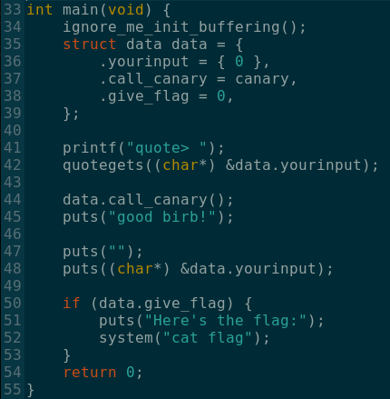
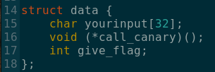
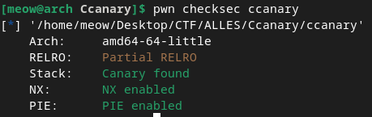
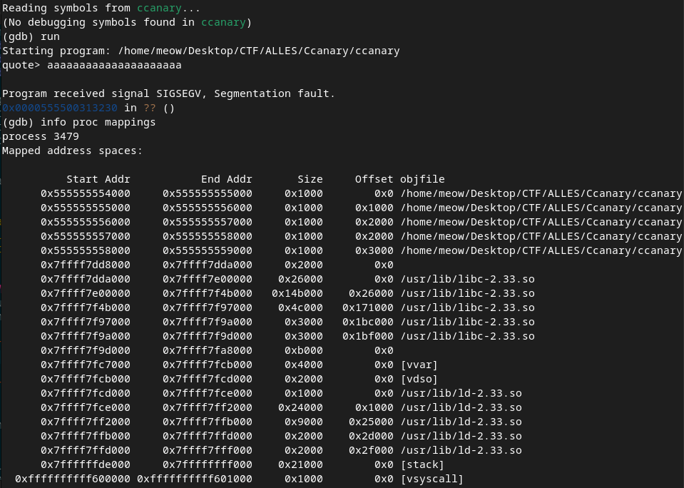
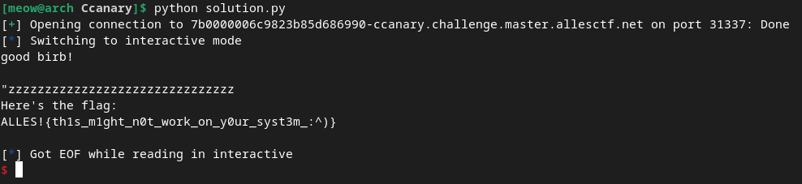

# Ccanary

This challenge includes a demonstration of a simple buffer overflow attack, with a little twist.

## Initial Thoughts

Since we are given the source code, let's have a look at it:



We can see that a local struct data is created, containing the user input, followed by a function pointer and then by a variable that will later decide wether or not the flag will be printed. Quite obviously, we need to overwrite that variable to 1.

Let's have a look at the struct to tell what's going on:



We can see that user input is 32 bytes, so we should be able to easily overflow that and reach the variable we want to overflow.

The problem arises at line 44 of main, where the second field of the struct, the function pointer, is called. In a normal call this would just call the canary function and move on, however in the case of an overflow, the address will be overwritten and the garbage in it will act as an address to be called, which will obviously lead in the termination of the program if the address is not correct.

## Breaking the protection

The most obvious way through this, is to find the adddress of a function and overwrite the canary with it. Let's check the executable to see if we can do that:



As we can see it's a PIE(Position Independent Executable), which means we won't be able to hardcode the address of a function, as that will change on every execution of the program.

However, as the challenge description is "I'm using Arch btw", apart from the meme, let's try and see if there is any arch-specific runtime mappings in the executable that make in not secure:



We can instantly notice vsyscall, a segment used to accelerate certain linux system calls. However, this segment's page is statically allocated to the exact same address in every execution since it's hardcoded in the kernel's application binary interface. This defeats the entire purpose of position independent code and ASLR and is removed by default in newer kernel builds.

## Getting the flag

Now that we know that vsyscall is statically allocated, we will try to overwrite the canary pointer to point to vsyscall, and then ovewrite the give_flag variable.

So our payload will need be constructed as:
* Fill the 32 bytes of the user buffer
* Overwrite the canary with the vsyscall address (0xffffffffff600000)
* Overwrite the give_flag variable with 1

So let's write our script using pwntools:

```python
from pwn import *

conn = remote('7b0000006c9823b85d686990-ccanary.challenge.master.allesctf.net', 31337, ssl=True)

vsyscall_addr = 0xffffffffff600000

conn.sendlineafter(b'> ', b'z'*31 + p64(vsyscall_addr) + p8(1))

conn.interactive()
```

and by running it



we get the flag:

ALLES!{th1s_m1ght_n0t_work_on_y0ur_syst3m_:^)}
