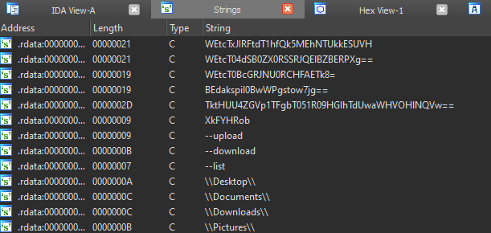
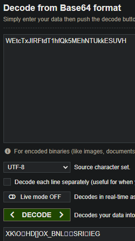
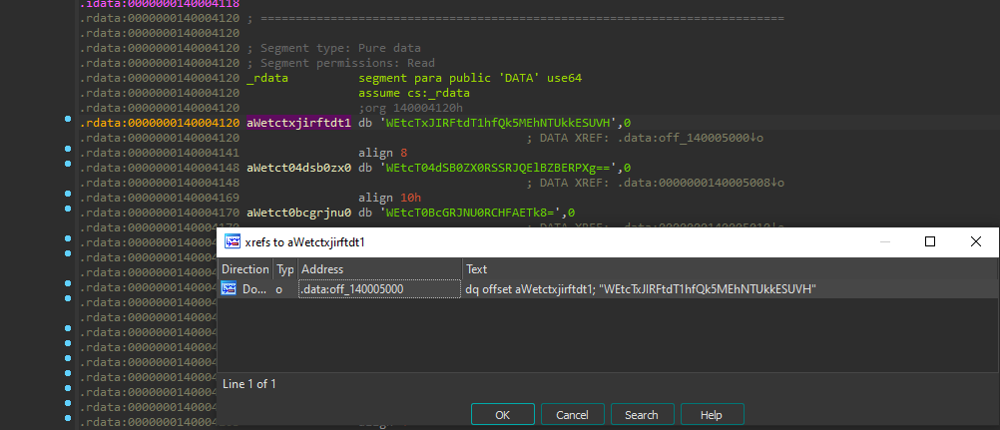
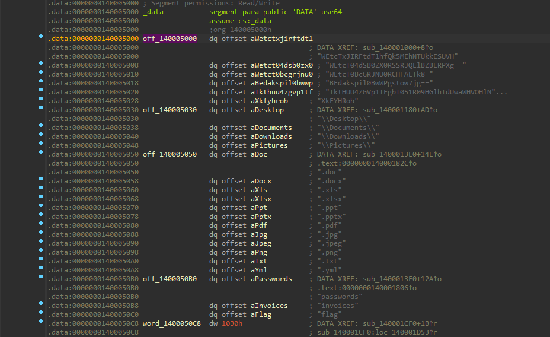
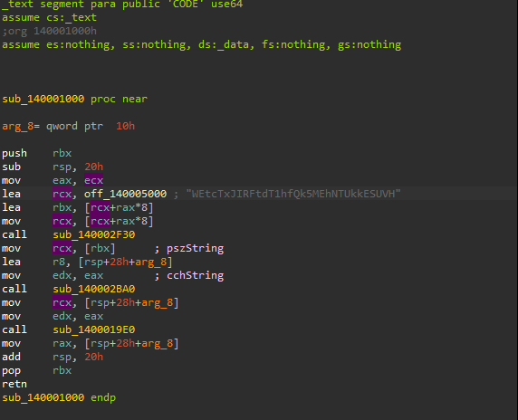
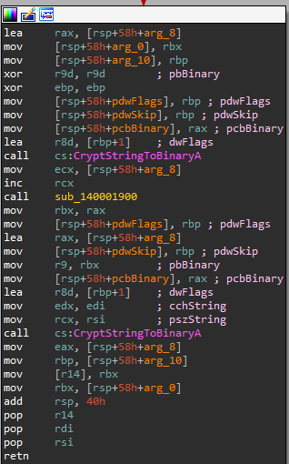
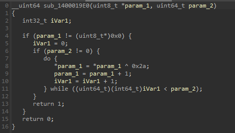
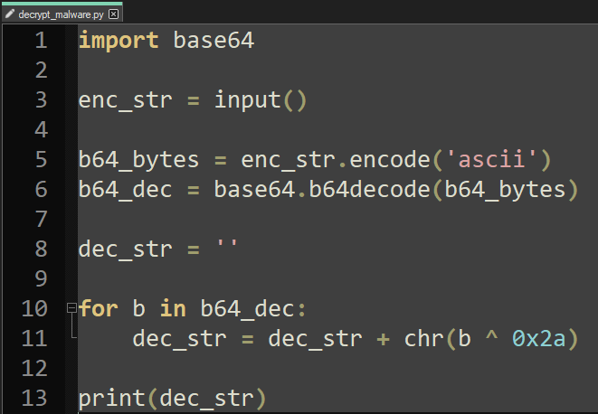
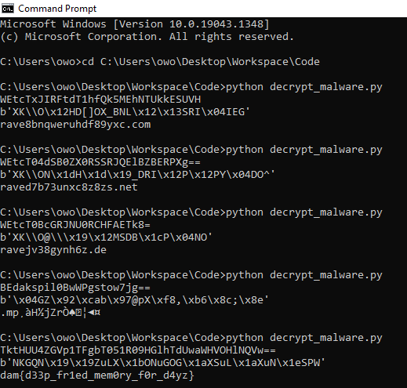

# Danceparty

## tl;dr

Malware using strings that are first xor'd with a hex value and then encoded into base64

## Initial Thoughts

We analyze the executable with IDA. First things first, we check the strings with Shift-F12:

We notice some very obviously base64 encoded strings along with some file paths. Let's attempt to decode one of the base64 strings:

The output is not readable. However, it's random bytes so we instantly consider the chance of it being double encoded. Let's get into it.

## Reversing The Strings

We double click the first base64 string to get to its location in memory, and then we list xrefs to that memory location as we're currently in the read only data segment(rdata):

Double click and head to .data:off_140005000:

We are now at the non-read only data segment(.data). Lets list xrefs to the memory location again, and head to it. We arrive at the following function:

We don't know much about the first function that's called(sub_140002F30), but we can see that the string(pszString) and it's length(cchString) are passed as arguments on the second function(sub_140002BA0). Let's check the second function:

We see CryptStringToBinaryA, which is used to turn a string into a byte array. At this point we consider that this might be executed after the string is decrypted from base64, in order to further decode that non readable array of bytes we saw above. Let's head to the third function(sub_1400019E0) that takes as a parameter the byte array produced by the function above:

Bingo! Every byte of the array is XOR'd with 0x2a. Finally the random byte array might make sense now. Let's write a python script that first decodes from base64 and then XOR's every byte with 0x2a:

And lets run it for all the strings:

Voila, dam{d33p_fr1ed_mem0ry_f0r_d4yz}
