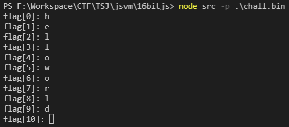
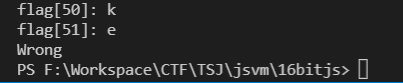
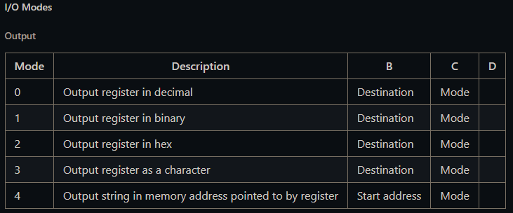

# JavaScript VM

## tl;dr 

A binary built using a Virtual Machine built on NodeJS

## Analysis

We get given an [open source JavaScript VM](https://github.com/francisrstokes/16bitjs) and a binary file compiled using it's compiler.

 By running the binary in the VM we can see that it asks for the flag 1 character at a time. 52 characters are required for the flag:



and ends with "Wrong":



## Disassembling

In order to see some sort of source code and try and analyze, I studied the VM's behavior with different instructions to be able to reconstruct the pseudo-assembly given the binary file.

The VM runs on 16-bit (2-byte) instructions. We can pull every instruction's opcode and structure from the VM and create a python disassembler than will bring the binary file into a readable pseudo-assembly format.

The result looks like this:

```asm
0x0: MVI A 2
0x1: JMR A
0x2: MVI D 75
0x3: AUI D 0
0x4: CAL D (0x4b)
0x5: MVI A 30
0x6: AUI A 1
0x7: LDR C 0x0[A]
0x8: MVI A 31
0x9: AUI A 1
0xa: LDR A 0x0[A]
0xb: MVI D 27
0xc: AUI D 0
0xd: GTE A C D
0xe: MVI D 156
0xf: AUI D 0
0x10: CAL D (0x9c) unnamed_2();
0x11: MVI D 211
0x12: AUI D 0
0x13: CAL D (0xd3) unnamed_3();
0x14: MVR C C 1
0x15: MVI A 30
0x16: AUI A 1
0x17: STR C 0x0[A]
...
```

The full disassembled file is too big so I've included it as a file. I've also included my python disassembler both as a file and at the end of this README. Let's look at the disassembled pieces that are useful to us...

## Discovering Calls

We can see the following reoccuring pattern calls:
```asm
0x2: MVI D 75
0x3: AUI D 0
0x4: CAL D (0x4b)
```

```asm
0xe: MVI D 156
0xf: AUI D 0
0x10: CAL D (0x9c);
```

```asm
0x11: MVI D 211
0x12: AUI D 0
0x13: CAL D (0xd3);
```

A number gets moved into a register and then the register gets called. This means that we can distinguish 3 different functions that are being called from the program's start that we will see below.

## Main

Looking at the disassembly's start, just after the first call, we see the following:

```asm
0x4: CAL D (0x4b)
0x5: MVI A 30
0x6: AUI A 1
0x7: LDR C 0x0[A]
0x8: MVI A 31
0x9: AUI A 1
0xa: LDR A 0x0[A]
0xb: MVI D 27
0xc: AUI D 0
0xd: GTE A C D
```

This can be somehow disassembled as:
```
A <- 30
A <- A + 256
C <- *A
A <- 31
A <- A + 256
A <- *A

// By this point C = *(30 + 256), A = *(31 + 256)
D <- 27
IF A >= C GOTO D // IF mem[31] < mem[30] GOTO 27
```

But by checking around 27 (0x1B):

```asm
0x14: MVR C C 1
0x15: MVI A 30
0x16: AUI A 1
0x17: STR C 0x0[A]
0x18: MVI D 5
0x19: AUI D 0
0x1a: JMR A
0x1b: MVI A 29
0x1c: AUI A 1
0x1d: MVI B 0
0x1e: AUI B 0
```

We can decompile this as:

```
C <- C + 1
A <- 30
A <- A + 1
*A <- C
D <- 5
GOTO D // GOTO 5
...  <- 0x1B
```

Because 5 is the start of the loop (0x5) and C is being increased by 1 then being stored in mem[30], while then also being checked in the start of the loop and compared as mem[30] < mem[31], we can kind of guess this might be a for loop. Because of this, we decompile this and it's inner code as:

```c++
read_input();
while(swirl_counter < mem[31]){ // 32 loops
    swirl();
    add_or_smth();
    swirl_counter++;
}
```

We also notice SYS calls. If we look at the VM's handling of SYS calls, we can see that it handles it the following way:

```
IF REGISTER_A == 0 THEN
    STDOUT
ELSE
    STDIN
```

Also, when stdout, the following modes are presented depending on register C:



So for example, the assembly piece:

```asm
0x43: MVI A 0
0x44: AUI A 0
0x45: MVI B 254
0x46: AUI B 1
0x47: MVI C 4
0x48: AUI C 0
0x49: SYS
```

Would print the string at memory location 254 + 256 to stdout.

We disassemble the rest of the main function (till we meet 0x4b which we found as the first function) in a similar way to get:

```c++
read_input();
while(swirl_counter < mem[31]){ // 32 loops
    swirl();
    add_or_smth();
    swirl_counter++;
}

for(int iter = 0; i < flag_len; ++i){
    if(enc_flag[iter] != input_flag[iter]){
        stdout_string("Wrong!\n"); // "Wrong!"
        exit();
    }
}

stdout_string("Correct!"); // "Correct!"
exit()
```

Naming is already done by me, but quite obviously 32 rounds of some encryption are run on the input which is then compared with some sort of encrypted flag in the binary's memory.

## Input

```c++
void read_input(){
    for(int g_iter = 0; g_iter < g_flag_len; ++i){
        stdout_string("flag["); // "flag[" 
        stdout_number(g_iter);  // counter (mem[28])
        stdout_string("]: ");   // "]:"

        do{
            temp = input(); // input
        }while(temp < 1);

        g_input_flag[g_iter] = temp;

        stdout_char(temp);
        stdout_char("\n"); // "\n"
    }
    return;
}
```

## Swirl

```c++
void swirl(){
    for(int iter = 0; i < g_input_flag_len; ++i){
        temp = g_input_flag[iter];
        g_input_flag[iter] = g_input_flag[swirl[iter]];
        g_input_flag[swirl[iter]] = temp;
    }
    return;
}
```

## Mess

```c++
void mess(){
    for(int iter = 0; i < flag_len; ++i){
        g_input_flag[iter] = mapper[(iter + swirl_counter + 11) % flag_len]
    }
    return;
}
```

## Decryptor

We import the 3 52-byte arrays that we found above into a python script - the swirl array (256 + 32), the mapper array (256 + 132) and the encrypted flag (256 + 191).

The original obfuscation is given by the following algorithm:
```
input_flag <- input()

loop from 0 to 31:
    swirl(input_flag)
    wrap(input_flag)
    
if in == encrypted_flag:
    correct
```

This encryption can be reversed as:

```
input <- encrypted_flag

loop from 31 to 0:
    swirl_backwards(input)
    wrap_backwards(input)

print("Flag: " + input)
```

With swirl_backwards and wrap_backwards just doing the same as swirl and wrap but in reverse order (from 51 to 0).

In python:

```python
# 32
swirl = [28,10,17,38,37,13,26,14,25,23,3,15,21,18,41,19,4,16,5,39,8,32,27,33,11,0,34,46,36,35,51,47,22,6,40,2,29,7,24,45,12,44,31,30,49,43,48,42,50,1,20,9]

# 132
mapper = [0x61,0x65,0x71,0x75,0x65,0x6f,0x73,0x61,0x6c,0x69,0x6e,0x6f,0x63,0x61,0x6c,0x63,0x61,0x6c,0x69,0x6e,0x6f,0x63,0x65,0x72,0x61,0x63,0x65,0x6f,0x61,0x6c,0x75,0x6d,0x69,0x6e,0x6f,0x73,0x6f,0x63,0x75,0x70,0x72,0x65,0x6f,0x76,0x69,0x74,0x72,0x69,0x6f,0x6c,0x69,0x63]

# 191
encoded_flag = [0x7f,0x94,0xd4,0xf2,0xf7,0xaf,0x98,0xba,0x9e,0xd7,0x85,0xb3,0xfb,0xdd,0xcf,0xb7,0xe6,0x5e,0x03,0xaf,0xd8,0xb3,0xc3,0xb7,0xbe,0xa2,0xbd,0x51,0xaa,0x98,0xd1,0xa4,0xc4,0xa0,0x62,0x61,0x57,0x91,0x58,0x9d,0xf8,0xc5,0xaf,0x88,0xb4,0xba,0xe9,0xaf,0xdf,0xa9,0xb9,0xd9]

flag_len = len(encoded_flag)
def do_swirl():
    for i in reversed(range(flag_len)):
        temp = encoded_flag[i]
        encoded_flag[i] = encoded_flag[swirl[i]]
        encoded_flag[swirl[i]] = temp

def do_ath(swirl_counter):
    for i in reversed(range(flag_len)):
        encoded_flag[i] = (encoded_flag[i] - mapper[(i + swirl_counter + 11) % flag_len]) & 0xFF

for i in reversed(range(32)):
    do_ath(i)
    do_swirl()

print(''.join([chr(c) for c in encoded_flag]))
```

## Flag

## Disassembler

```py
import math

class bcolors:
    HEADER = '\033[95m'
    OKBLUE = '\033[94m'
    OKCYAN = '\033[96m'
    OKGREEN = '\033[92m'
    WARNING = '\033[93m'
    FAIL = '\033[91m'
    ENDC = '\033[0m'
    BOLD = '\033[1m'
    UNDERLINE = '\033[4m'

constants = {
    'INSTRUCTIONS': [
        'MVR',
        'MVV',
        'LDR',
        'STA',
        'ATH',
        'CAL',
        'JCP',
        'PSH',
        'POP',
        'JMP',
        'JMR',
        'LDA',
        'STR',
        'NOA'
    ],
    'REGISTERS': [
        'A',
        'B',
        'C',
        'D'
    ],
    'ARITHMETIC': [
        'ADD',
        'SUB',
        'MUL',
        'DIV',
        'INC',
        'DEC',

        'LSF',
        'RSF',
        'AND',
        'OR',
        'XOR',
        'NOT'
    ],
    'MOVE': [
        'MVI',
        'ADI',
        'MUI',
        'AUI'
    ],
    'SYSOPS': [
        'NOP',
        'RET',
        'SYS',
        'HALT'
    ],
    'JUMP': [
        'EQ',
        'NEQ',
        'LT',
        'GT',
        'LTE',
        'GTE',
        'ZER',
        'NZE'
    ]
}

registers = {
    'A': 0,
    'B': 0,
    'C': 0,
    'D': 0
}

sBinary = open('chall.bin', 'rb').read()
print(len(sBinary))

lFuncCounter = 1
lLastFuncOffset = 0
fFunctions = {}

for lIter in range(0, math.floor(len(sBinary)), 2):
    lInstrOffset = math.floor(lIter / 2)
    iBitInstr = bin(sBinary[lIter+1])[2:].zfill(8) + bin(sBinary[lIter])[2:].zfill(8)

    iOpCode = int(iBitInstr[12:16], 2)
    sOpCode = constants['INSTRUCTIONS'][iOpCode]

    # Registers
    rDest = int(iBitInstr[10:12], 2)

    if sOpCode == 'ATH':
        iOperation = int(iBitInstr[4:8], 2)
        bShiftVal = int(iBitInstr[:3], 2)
        rSrc = int(iBitInstr[8:10], 2)
        mMode = int(iBitInstr[3], 2)

        if mMode == 1:
            sOutInstr = f"{hex(lInstrOffset)}: {constants['ARITHMETIC'][iOperation]} {constants['REGISTERS'][rSrc]} {constants['REGISTERS'][rDest]}"
        else:
            sOutInstr = f"{hex(lInstrOffset)}: {constants['ARITHMETIC'][iOperation]} {constants['REGISTERS'][rDest]} {constants['REGISTERS'][rSrc]}"
        
    elif sOpCode == 'CAL':

        fFunctions[lLastFuncOffset] = f"unnamed_{lFuncCounter}"
        lFuncCounter += 1
        sOutInstr = f"{hex(lInstrOffset)}: {bcolors.OKCYAN}{constants['INSTRUCTIONS'][iOpCode]} {constants['REGISTERS'][rDest]} {bcolors.ENDC}{bcolors.OKGREEN}({hex(lLastFuncOffset)}){bcolors.ENDC}"
    elif sOpCode == 'MVV':
        iOperation = int(iBitInstr[8:10], 2)
        sOperation = constants['MOVE'][iOperation]
        rValue = int(iBitInstr[:8], 2)

        if sOperation == 'MVI':
            lLastFuncOffset = rValue

        sOutInstr = f"{hex(lInstrOffset)}: {sOperation} {constants['REGISTERS'][rDest]} {rValue}"
    elif sOpCode == 'JMR':
        rSrc = int(iBitInstr[8:10], 2)

        sOutInstr = f"{hex(lInstrOffset)}: {constants['INSTRUCTIONS'][iOpCode]} {constants['REGISTERS'][rSrc]}"
    elif sOpCode == 'NOA':
        iOperation = int(iBitInstr[8:12], 2)
        sOperation = constants['SYSOPS'][iOperation]

        sOutInstr = f"{hex(lInstrOffset)}: {bcolors.HEADER}{constants['SYSOPS'][iOperation]}{bcolors.ENDC}"
    elif sOpCode == 'PSH':
        rSrc = int(iBitInstr[8:10], 2)

        sOutInstr = f"{hex(lInstrOffset)}: {constants['INSTRUCTIONS'][iOpCode]} {constants['REGISTERS'][rSrc]}"
    elif sOpCode == 'POP':

        sOutInstr = f"{hex(lInstrOffset)}: {constants['INSTRUCTIONS'][iOpCode]} {constants['REGISTERS'][rDest]}"
    elif sOpCode == 'LDA':
        lAddr = hex(int(iBitInstr[:10], 2))

        sOutInstr = f"{hex(lInstrOffset)}: {constants['INSTRUCTIONS'][iOpCode]} {constants['REGISTERS'][rDest]} {lAddr}"
    elif sOpCode == 'LDR':
        rSrc = int(iBitInstr[8:10], 2)
        lOffset = hex(int(iBitInstr[:8], 2))

        sOutInstr = f"{hex(lInstrOffset)}: {constants['INSTRUCTIONS'][iOpCode]} {constants['REGISTERS'][rDest]} {bcolors.OKGREEN}{lOffset}{bcolors.ENDC}[{rSrc}]"
    elif sOpCode == 'JCP':
        iOperation = int(iBitInstr[3:6], 2)
        rSrc = int(iBitInstr[8:10], 2)
        lAddr = int(iBitInstr[6:8], 2)

        sOutInstr = f"{hex(lInstrOffset)}: {constants['JUMP'][iOperation]} {constants['REGISTERS'][rSrc]} {constants['REGISTERS'][rDest]} {constants['REGISTERS'][lAddr]}"
    elif sOpCode == 'MVR':
        rSrc = int(iBitInstr[8:10], 2)
        vValue = int(iBitInstr[:8], 2)

        sOutInstr = f"{hex(lInstrOffset)}: {constants['INSTRUCTIONS'][iOpCode]} {constants['REGISTERS'][rDest]} {constants['REGISTERS'][rSrc]} {vValue}"
    elif sOpCode == 'STR':
        rSrc = int(iBitInstr[8:10], 2)
        lOffset = hex(int(iBitInstr[:8], 2))

        sOutInstr = f"{hex(lInstrOffset)}: {constants['INSTRUCTIONS'][iOpCode]} {constants['REGISTERS'][rSrc]} {bcolors.OKGREEN}{lOffset}{bcolors.ENDC}[{constants['REGISTERS'][rDest]}]"
    else:
        sOutInstr = f"{hex(lInstrOffset)}: {constants['INSTRUCTIONS'][iOpCode]}"

    if(lInstrOffset in fFunctions):
        print(f"\n{bcolors.WARNING}-- Function {fFunctions[lInstrOffset]} --{bcolors.ENDC}")
    print(sOutInstr)
```