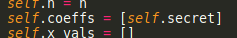
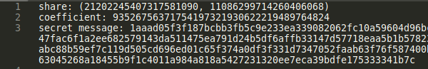
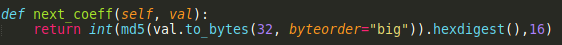
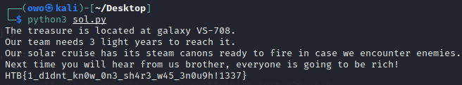

<!--
+++
title="Tenth Post"
date=2019-07-29

[taxonomies]
categories = ["Sample Post"]
tags = ["post", "lorem"]
+++
-->


# Space Pirates

## tl;dr 

Exploiting a flaw in Shamir's Encryption when a share and the calculation of the coefficients is known, into decryption of an afine cipher

## Analysis

Shamir's Secret Sharing (SSS) is used to secure a secret in a distributed way, most often to secure other encryption keys. The secret is split into multiple parts, called shares. These shares are used to reconstruct the original secret.

Basically a polynomial is created using random coefficients, and shares are created for x = 0, x = 1 etc.

In our case, we can see that the first coefficient is the secret and that it's randomly generated:



However, we're also given the second coefficient at the encrypted file:



We can also see the way of calculating the next coefficients. Basically, coefficient[i + 1] = MD5(coefficient[i]), so this is somewhat of a MD5 chain:



Clearly, we can tell that the second coefficient that we are given is the MD5 of the secret. Sadly this is not reversible.

## Breaking The Secret

Knowing the second coefficient, however, we can calculate every other coefficient using MD5. We can see that n is set to 10, so we only need to calculate the 9 first coefficients as we don't know the secret.


Therefore, we will have an equation of something like:

y = (coeff[0]x^0 + coeff[1]x^1 + coeff[2]x^3 + ... + coeff[9]x^9) % m

However, we know that coeff[0] is the secret, so this becomes something like:

y = (secret + coeff[1]x^1 + coeff[2]x^3 + ... + coeff[9]x^9) % m

Gets more clear now, right? We also have a pair of y and x. That pair tells us that if we put x = 21202245407317581090 in that polynomial, the output will be y = 11086299714260406068.

So let's sum up. We know y given x, we know m and we also know all coefficients other than secret. This means that coeff[1]x^1 + coeff[2]x^3 + ... + coeff[9]x^9 is known to us. Let's call that entire thing b. Summing up we have:

y = (secret + b) % m

This can be rewritten as:

y = (1secret + b) % m

We know that an affine cipher of type:

y = (ax + b) % m

can be decrypted as:

x = (a^-1)*(y - b)

where a^-1 is the GCD(a, m). Because a = 1, the GCD will be equal to 1. Therefore, it will look like this:

x = y - b

## Solvescript

We assemble a python script

```py
# solve.py
import base64
from Crypto import Random
from Crypto.Cipher import AES
from random import randint, randbytes,seed
from hashlib import md5
import math

def next_coeff(val):
	return int(md5(val.to_bytes(32, byteorder="big")).hexdigest(),16)

def calc_coeffs(init_coeff, coeffs):
	for i in range(8):
		coeffs.append(next_coeff(coeffs[i]))

def rev_secret(init_coeff, init_x, init_y, p):
	coeffs = [init_coeff]
	calc_coeffs(init_coeff, coeffs)
	# init_y = (secret + coeffs[1] * init_x + coeffs[2] * init_x^1 + ... + coeffs[9] * init_x^9) % P
	sum = 0

	for i in range(len(coeffs)):
		init_y -= coeffs[i] * (init_x ** (i + 1))

	GCD = math.gcd(p, 1)
	secret = (GCD * (init_y)) % p
	return secret

secret = rev_secret(93526756371754197321930622219489764824, 21202245407317581090, 11086299714260406068, 92434467187580489687)

enc = '1aaad05f3f187bcbb3fb5c9e233ea339082062fc10a59604d96bcc38d0af92cd842ad7301b5b72bd5378265dae0bc1c1e9f09a90c97b35cfadbcfe259021ce495e9b91d29f563ae7d49b66296f15e7999c9e547fac6f1a2ee682579143da511475ea791d24b5df6affb33147d57718eaa5b1b578230d97f395c458fc2c9c36525db1ba7b1097ad8f5df079994b383b32695ed9a372ea9a0eb1c6c18b3d3d43bd2db598667ef4f80845424d6c75abc88b59ef7c119d505cd696ed01c65f374a0df3f331d7347052faab63f76f587400b6a6f8b718df1db9cebe46a4ec6529bc226627d39baca7716a4c11be6f884c371b08d87c9e432af58c030382b737b9bb63045268a18455b9f1c4011a984a818a5427231320ee7eca39bdfe175333341b7c'

seed(secret)
key = randbytes(16)
cipher = AES.new(key, AES.MODE_ECB)
enc_FLAG = cipher.decrypt(bytes.fromhex(enc)).decode("ascii")
print(enc_FLAG)
```

## Flag

Running the script:


