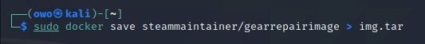
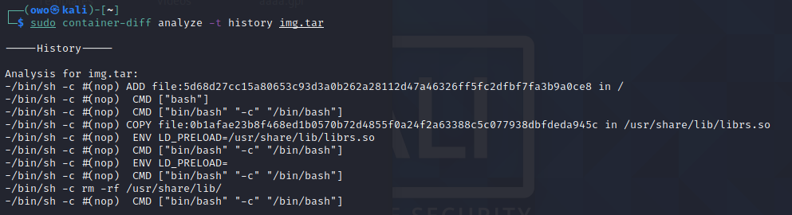
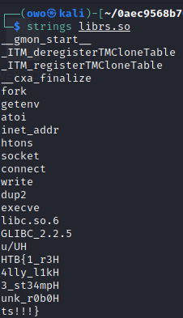

# Peel Back The Layers


## tl;dr

Docker image that contains history that exposes a c library containing the flag

## Analysis

We can pull the image with

```sh
docker pull steammaintainer/gearrepairimage
```

We can export the image to a tar like this:



Then we can check the history using container-diff: 



A file was copied to /usr/share/lib. Let's check it:

Navigate to 0aec9568b70f59cc149be9de4d303bc0caf0ed940cd5266671300b2d01e47922/layer.tar/usr/share/lib

## Flag

Use strings on the library:



The flag is right there:

HTB{1_r34lly_l1k3_st34mpunk_r0b0ts!!!}