# Hardware Madness

## tl;dr

CPU circuit with custom defined instructions that need to be assembled into binary

## Analysis

Let's open the circuit in Logisim Evolution:

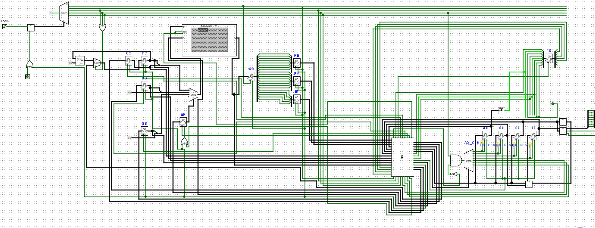

We can obviously see this is a CPU circuit. We can see a PC (Program Counter), RAM, Registers, an ALU and a bus. We can click on Simulate on top left and click on CU to get a view of the instructions this circuit can run:

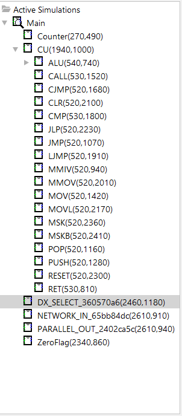

## Analysing The Example

Before we move forward, let's take a look at the example files:

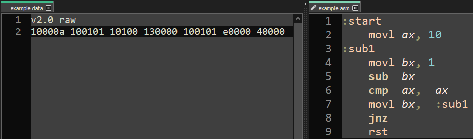

We can see 7 custom-assembly instructions on the example.asm file and 7 3-hex assembled instructions on the left. To understand the structure of this a bit more, let's take a look at how instructions are broken down in the circuit:

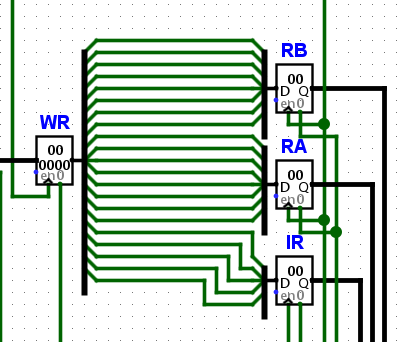

The instruction that's stored in WR is broken down in 21 bits. The structure is the following:

| opcode       | arg1           | arg2          |
|    :---:     |     :---:      |     :---:     |
| 16-20        | 8-15           | 0-7           |

The opcode takes 5 bits while both the arguments take 8 bits each. This means we can represent all of them with one hex (byte) each. 

## Breaking Down The Instrucitons

Looking back at the example:


Let's take a look at the instructions:

```asm
movl ax, 10
```

turns into 10000a when assembled. We can break that down to [10][00][0a] or:

| opcode       | arg1           | arg2          |
|    :---:     |     :---:      |     :---:     |
| 10           | 00             | 0a            |

Which basically tells us:

1. The instruction is 0x10, so movl
2. The first argument is 00, so it corresponds to the first register ax
3. The second argument is 0x0a, which corresponds to the hex value 0A or decimal 10
4. Summarizing, we move the value 0x0A into ax

The same very basic logic goes for every other instruction. Now if we knew every instruction's opcode, we could technically assemble any instruction we find in our way.

## Labels

Before we get to that, let's also look at our 7th instruction:

```asm
movl bx, :sub1
```

This instruction obviously moves the label :sub1 into the register bx. This instruction gets turned into 100101 or:

| opcode       | arg1           | arg2          |
|    :---:     |     :---:      |     :---:     |
| 10           | 01             | 01            |

Where arg2 is obviously the label. The value 1 is given to us to point to label :sub1, which is right before the second instruction. This would mean that a label is an address pointer, so we would also need to keep track of those in our assembler.

## Reversing The Opcodes

We now know the structure that we want to assemble into. What we're missing is the opcodes. Let's open up our CPU instructions again:


Clicking on any one of those will take us to the corresponding circuit that handles the instruction. For example, let's go to the CALL instruction:

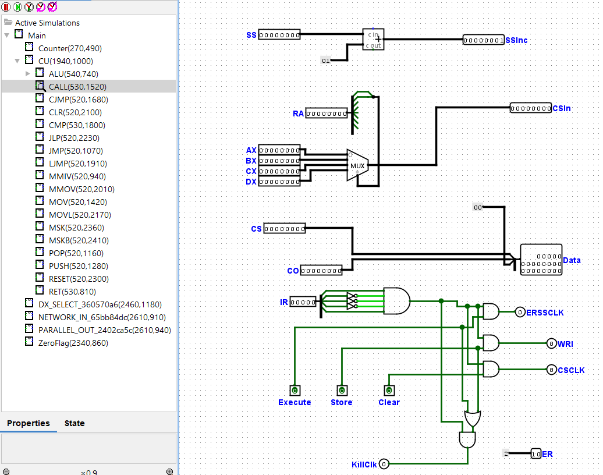

We see the entire CALL circuit. We can see a couple of inputs here. The ones that we care about are:

1. IR (Instruction Register)
2. AX, BX, CX, DX (General Purpose Registers)

Let's look closer into the IR input:

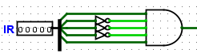

We can clearly see that this becomes 1, if and only if the value in IR is 10001 or 0x11. Voila, we found the opcode for CALL!. We can repeat this for any other instruction. Let's also check CJMP:

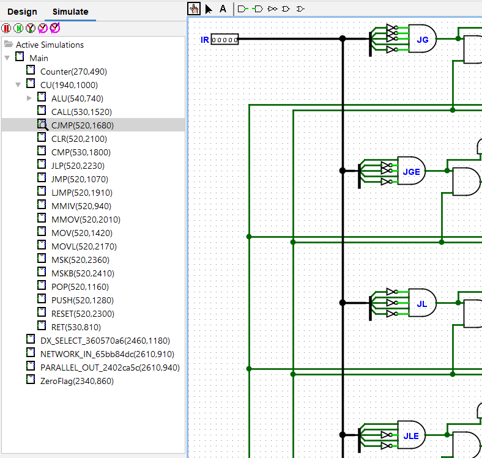

Here we can instead see that IR goes into multiple AND gates. Each one of those is a specific jump instruction, i.e. JG (Jump Greater), JGE (Jump Greater Or Equal), JL (Jump Less) etc...

We can extract the opcodes for all of these. For example, we can see that JL becomes 1 if and only if IR is 01010 or 0x0a.

## Assembling

Since we now know everything we need to assemble the code, let's write an assembler for this. 

We first define the opcodes. I only define the ones we actually use in program.data:

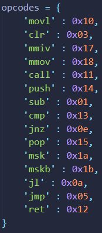

We can then define the registers:

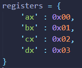

Before we start assembling, we also need to parse the labels:

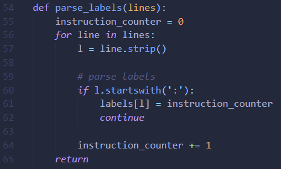

We come up with the following script:

```py
# assembler.py
input = open('program.asm', 'r')
out = open('program.data', 'w+')

binary = []

# opcodes
opcodes = {
    'movl' : 0x10,
    'clr' : 0x03,
    'mmiv' : 0x17,
    'mmov' : 0x18,
    'call' : 0x11,
    'push' : 0x14,
    'sub' : 0x01,
    'cmp' : 0x13,
    'jnz' : 0x0e,
    'pop' : 0x15,
    'msk' : 0x1a,
    'mskb' : 0x1b,
    'jl' : 0x0a,
    'jmp' : 0x05,
    'ret' : 0x12
}

# registers
registers = {
    'ax' : 0x00,
    'bx' : 0x01,
    'cx' : 0x02,
    'dx' : 0x03
}

labels = {}

def make_operand(operand):
    # If addition on label
    if len(operand.split('+')) == 2:
        arr = operand.split('+')
        return str(hex(labels[arr[0]] + int(arr[1], 10))[2:]).zfill(2)

    # Convert depending on type
    if operand in registers:
        return str(hex(registers[operand])[2:]).zfill(2)
    elif operand in labels:
        return str(hex(labels[operand])[2:]).zfill(2)
    elif operand.startswith('0x'):
        return str(hex(int(operand, 16))[2:]).zfill(2)
    elif operand.isnumeric:
        return str(hex(int(operand, 10))[2:]).zfill(2)
    else:
        return str(hex(int(operand, 16))[2:]).zfill(2)
        
def parse_labels(lines):
    instruction_counter = 0
    for line in lines:
        l = line.strip()
        
        # parse labels
        if l.startswith(':'):
            labels[l] = instruction_counter
            continue
            
        instruction_counter += 1
    return
    
def compile():
    out.write('v2.0 raw\n')
    for instr in binary:
        out.write(instr + ' ')
    return

def parse():
    instruction_counter = 0
    lines = input.readlines()
    parse_labels(lines)
    print(labels)
    for line in lines:
        l = line.strip()

        if l.startswith(':'):
            continue

        instruction = ''
        opcode = l.split(' ')[0]
        instruction += str(hex(opcodes[opcode])[2:])
        
        # remove empty spaces
        args = [x.replace(',', '') for x in l.split(' ') if x != '']
        
        # check if instruction with no args
        if len(args) != 1:
            instruction += make_operand(args[1])
            instruction += make_operand(args[2])        
        else:
            instruction += '0000'
        
        binary.append(instruction)
        instruction_counter += 1
        

parse()
compile()
#print(labels)
```

And we use it to compile the binary.

## Flag

We go back to our circuit and load our binary into the RAM:

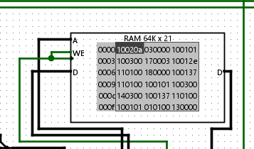

We then set the frequency to the highest and run the simulation with "Auto-Tick Enabled" and "Auto-Propagate":

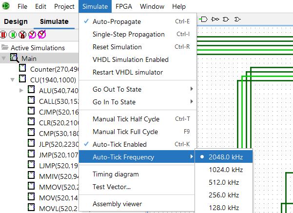

After a few minutes, the flag appears in the tty:

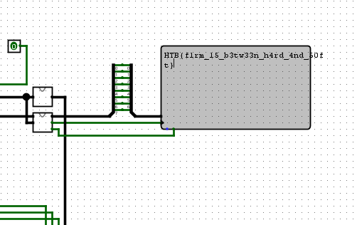