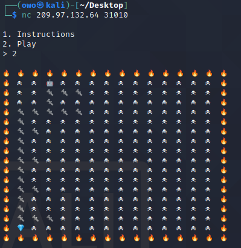

# Insane Bolt

## tl;dr

A game where we have to find the shortest path to the diamond without touching the mines, and do it 500 times

## Initial Execution

Connecting to the server with netcat, we see the following:


The instructions are pretty clear. We get the board and we have to reach the diamond in the shortest path possible. We have to collect 500 diamonds so obviously we have to run this 500 times. Let's try the game out:



We attempt to solve the first game:


And this will continue on for 500 times. Let's use python instead of writing this by hand:

```python
# solve.py
from pwn import *

# define emote hexs
PLAYER = b'\xf0\x9f\xa4\x96'
FIRE = b'\xf0\x9f\x94\xa5'
MINE = b'\xe2\x98\xa0\xef\xb8\x8f'
WRENCH = b'\xf0\x9f\x94\xa9'
DIAMOND = b'\xf0\x9f\x92\x8e'


conn = remote('167.172.51.245', '30766')

print(conn.recvuntil('> '))

conn.send(b'2\n')

diamonds = 0
wrenches = 0

# run game loop
while True:
    given = conn.recvuntil('> ')

    # parse game board
    game_parse = []
    lines = given.split(b'\n')
    initX = 0
    initY = 0
    i = -1
    j = 0
    for l in lines:
        ll = ''
        line = []
        emojis = l.split(b' ')
        j = 0

        # parse emotes in current line
        for e in emojis:
            if e == FIRE:
                line.append('F')
            elif e == MINE:
                line.append('B')
            elif e == WRENCH:
                line.append('W')
            elif e == PLAYER:
                line.append('P')
                initX = j
                initY = i
            elif e == DIAMOND:
                line.append('D')
            else:
                j = j - 1
            j = j + 1
        game_parse.append(line)
        i = i + 1

    # remove empty arrays
    game = [x for x in game_parse if x != []]
    for l in game:
        ll = ''
        for e in l:
            ll = ll + e + ' '
        print(ll)

    sol = []
    print('MaxX : ' + str(len(game[0])) + ' MaxY: ' + str(len(game)))

    # solve current board
    def solve(G, curX, curY, orig, path):
        # if out of bounds
        if curX < 0 or curX >= len(G[0]) or curY < 0 or curY >= len(G):
            return 9999
            
        cur = G[curY][curX]

        # if stepping on fire or mine
        if cur == 'F' or cur == 'B':
            return 9999

        # finally reached the diamond, exit recursion
        if cur == 'D':
            sol.append(path)
            return 0

        left = 9999
        right = 9999
        down = 9999

        # try right
        if orig != 'l':
            left = solve(G, curX - 1, curY, 'r', path + 'L')

        # try left
        if orig != 'r':
            right = solve(G, curX + 1, curY, 'l', path + 'R')

        # try down
        down = solve(G, curX, curY + 1, 'u', path + 'D')

        # return shortest path of above three
        return min(left, right, down) + 1


    minpath = solve(game, initX, initY, 'u', '')
    print(sol)
    conn.sendline(sol[0])

    diamonds = diamonds + 1
    wrenches = wrenches + minpath
    if diamonds >= 500 and wrenches >= 5000:
        break

    print(conn.recvline())
    print(conn.recvline())

conn.interactive()
```

Hopefully the comments are self explanatory, but in short:

1. We parse the current game board
2. We start at the player starting point
3. For each block we are on, we recursively check all adjacent blocks
4. If the block we are checking right now is either out of bounds or a mine/fire, we return 9999 to mark that path as very long
4. Once the diamond is reached, we return 0 and compare all paths, returning the shortest
5. Once the board is solved, send the solution and increase number of collected diamonds and wrenches
6. Jump to 1 till we have atleast 500 diamonds and 5000 wrenches

After solving 500 of them, we get the following:

