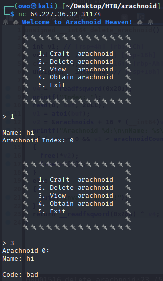
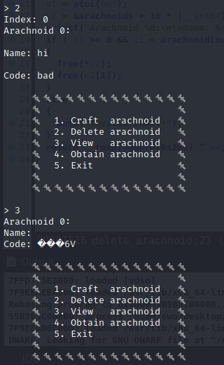
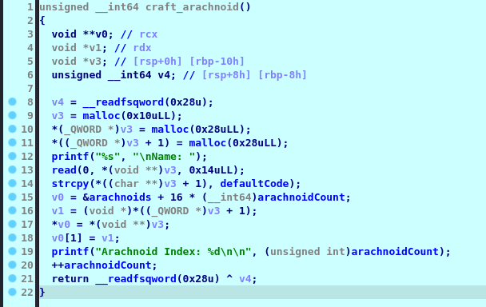
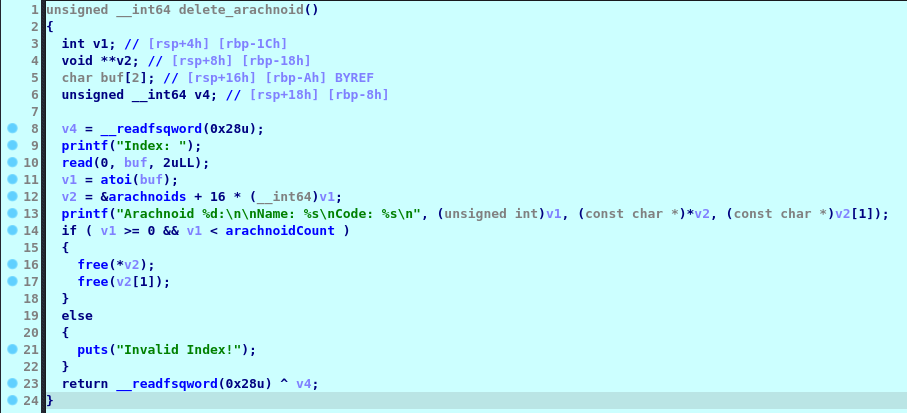
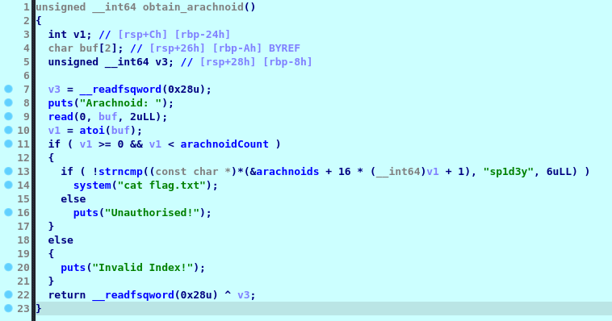
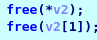
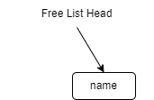
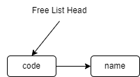
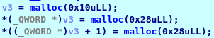
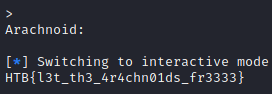

# Arachnoid Heaven

## tl;dr

C program that alocates and deletes objects with a dangling pointer vulnerability that allows for value modification

## Initial Execution

We connect to the server with netcat for some initial analysis. We can see that we can create, delete, view or obtain arachnoids.

We create and view one:



However, we try to delete the one we just made and then view it:



We have a pretty obvious dangling pointer here. We deleted the arachnoid, the strings were freed, but for some reason the actual arachnoid object is still there... Let's analyze in IDA:

## Analysis



Crafting is pretty straight forward. We allocated space for 2 pointers, then allocate those 2 pointers to point to two strings, the first being the name and the second one being the code. We see that the code is set to "bad" by default.

Let's move on to delete:



We see that we free the 2 strings, but we don't actually free the area containing the strings or atleast reduce the arachnoid count by 1, so the object remains there cointaining two freed (dangling) pointers.

Let's move to obtain:



We see that we can get the flag if we make one of the arachnoids contain the code "sp1d3y". The exploit is pretty clear here, let's explain it:

## Exploit

Let's take a dive into some C theory first:

When malloc is called, the C memory manager looks into what we call the "free list" first. This list contains previously allocated parts of memory using malloc that have now been freed. This way, those parts can be "recycled" into the new ones we need, if they're the same size ofcourse.

Let's assume that we have created an arachnoid. We then delete that arachnoid. With the deletion the following free's are called:



Both these strins are the same size, so they're going to be placed in the same free list. When the first free gets called, the free list will look something like this:



However, after the second free, the free list will look something like this:


This is because free list follows LIFO(Last In First Out), so the last deallocated memory location will be the first one to be next allocated. This is obviously a problem in this implementation.

If we now create an arachnoid, the malloc's will go in this order:



We can ignore the first one as it's not the same size. However, the first malloc will pick the first node off the free list. In our case this will be the old code string. The second one, will be the old name string.

What has happened here is that the new arachnoid has the code of the last arachnoid as name, and the name of the last arachnoid as code. The exploit is pretty clear here:

If we create an arachnoid, delete it, and then create an arachnoid with the name "sp1d3y", the first arachnoid's dangling pointer to it's code will be the pointer to the new arachnoid's name. This will make the first arachnoid's code be "sp1d3y". Let's write an exploit for this:

```python
# solve.py
from pwn import *

conn = remote('64.227.36.32', '31174')

def getl():
	return conn.recv().decode('utf-8')

# create first
print(getl())
conn.sendline(b'1')
print(getl())
conn.sendline(b'sp1d3y')

# delete first
print(getl())
conn.sendline(b'2')
print(getl())
conn.sendline(b'0')

# create second
print(getl())
conn.sendline(b'1')
print(getl())
conn.sendline(b'sp1d3y' + b'\0' + b'aa')

# get
print(getl())
conn.sendline(b'4')
print(getl())
conn.sendline(b'0')

conn.interactive()
```

## Flag

Running the exploit:

