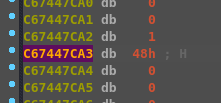

# The Vault

## tl;dr 

Binary that checks if the first argument given is the flag

## Analysis

We run the file with different inputs, nothing seems to work:

Open the executable in IDA and head into the function called by main. We can see the following comparison:

The current byte gets moved to v8 and then a value is read into v0 from some weird global indexing that we're not gonna get into. Those values are then checked if they are the same and if not, the program exits.

We won't mess with the indexing, just set a breakpoint right before the compare:

The value on var_22D is gonna be the one coming from the weird indexing. If we check this every iteration, we will get the flag byte by byte:

And the next one...

We use IDC function Byte to print out the value each iteration and F9 to continue the program so it is easier:

The final flag comes out as:

HTB{vt4bl3s_4r3_c00l_huh}