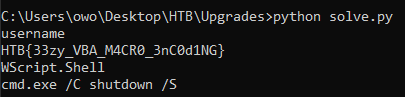

# Upgrades

## tl;dr

PowerPoint file that contains VBA macros with encrypted strings

## Analysing

We use olevba to spot and extract VBA macros from the PowerPoint:


We can see some string comparisons happening at the bottom, but it's between byte arrays that get passed through some "q" function:


## Decryption

Let's take a look at the q function:


This is pretty obviously a decrypt function, every byte goes through the same operation and then is turned into an actual character. The operation is the following:

```python
    decrypted = ''
    for byte in array:
        decrypted += chr((byte * 59 - 54) % 255)
    return decrypted
```

So every byte is multiplied by 59, then gets 54 substituted from it, and then is modulo'd by 255 to fit in a byte. We can write a python script to decrypt all of these arrays:

```python
# solve.py

enc_strings = [
                [81, 107, 33, 120, 172, 85, 185, 33],
                [154, 254, 232, 3, 171, 171, 16, 29, 111, 228, 232, 245, 111, 89, 158, 219, 24, 210, 111, 171, 172, 219, 210, 46, 197, 76, 167, 233],
                [215, 11, 59, 120, 237, 146, 94, 236, 11, 250, 33, 198, 198],
                [59, 185, 46, 236, 33, 42, 33, 162, 223, 219, 162, 107, 250, 81, 94, 46, 159, 55, 172, 162, 223, 11]
            ]

def deobf(arr):
    de = ''
    for c in arr:
        de = de + chr((c * 59 - 54) & 255)
    return de

for arr in enc_strings:
    print(deobf(arr))

```

## Flag

And running the script:

