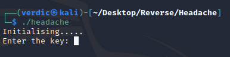
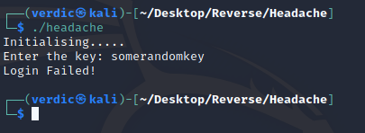
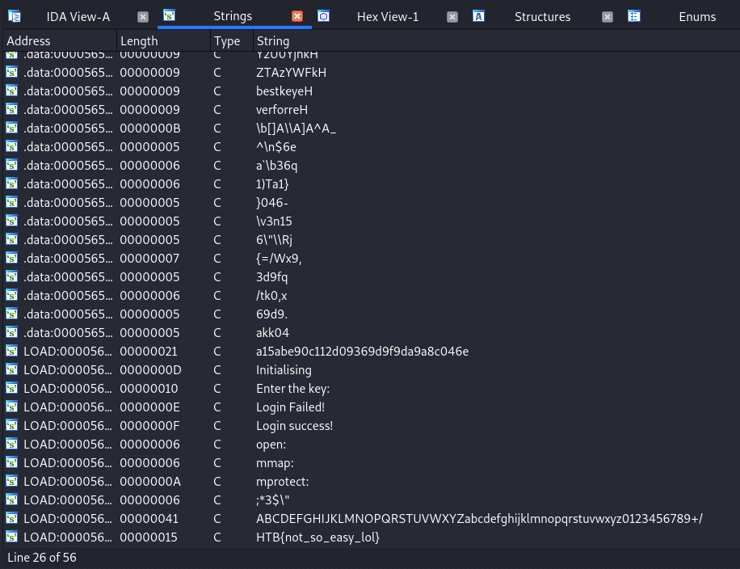
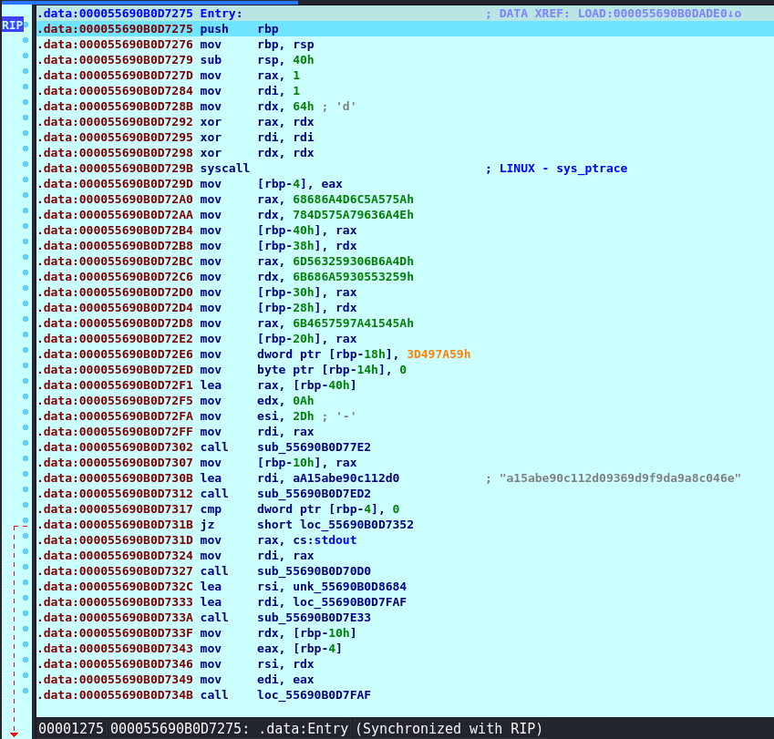

# Headache (actually)

## Initial Execution

First things first, the challenge provides us with a single UNIX executable. Let's try and run it to see the output...



Looks like it requires a key input, lets provide something random...



It appears that it has some kind of login system. Our initial thought will be that we are required to reverse the key in order to login. So let's get started!

## Disassembling

Opening the file in IDA, we can instantly tell it's a [stripped binary](https://en.wikipedia.org/wiki/Stripped_binary) as we see no trace of any functions, so let's start discovering some of them.

First things first, let's do a string search(Shift + F12). Maybe that would point us to the main function or some other kind of clue?



Along with a lot of random strings, we see some known strings from our first executions, such as:

* Initialising
* Enter the key:
* Login Failed!
* Login success!

We also see a blatantly fake flag, HTB{not_so_easy_lol}, let's assume and hope that's not the flag.

However, we can't yet XREF the strings to instantly find our function. As we can see, the strings belong to a LOAD:xx segment, which means its a not-yet-named ELF segment loaded from IDA, we know nothing about it yet.

Our only solution at this point is to debug step into main. Let's set a breakpoint in init_proc and slowly make our way into the program.


We keep F8'ing and we reach the following function that does some yet unknown stuff. Let's give it a name, say "Entry".



Right off the bat we see a couple of sketchy stuff.

1. A system call to 0x64, which corresponds to ptrace
2. A string ```a15abe90c112d09369d9f9da9a8c046e``` that looks nothing that we know of yet, but seems to be used as input to some function

Let's note those down for later. If we keep debugging, we can see that the program continues on 
```assembly
call    loc_55690B0D7FAF
```
so let's assume that is our main function and rename it
