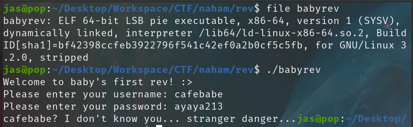
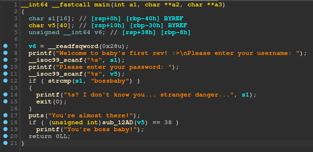
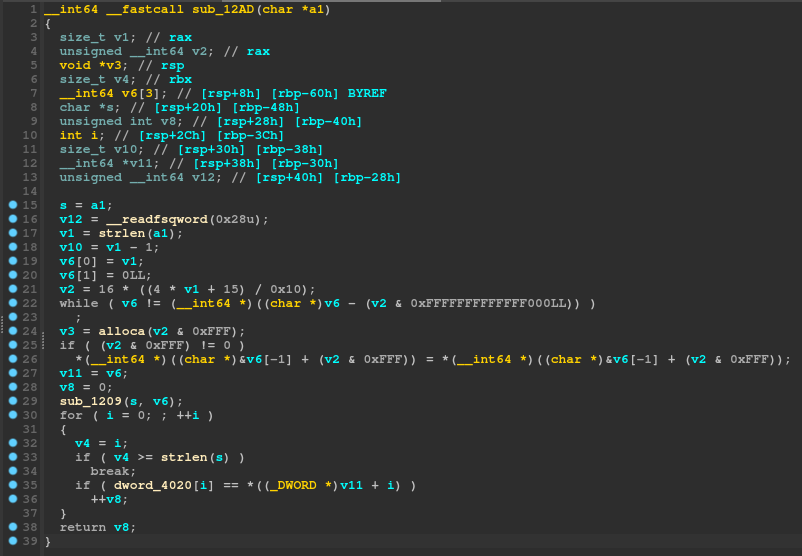
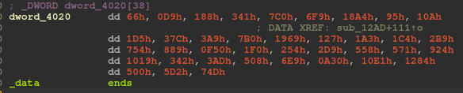
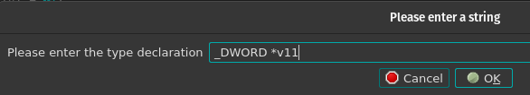
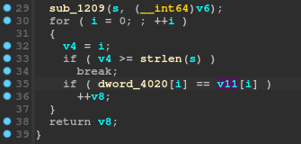
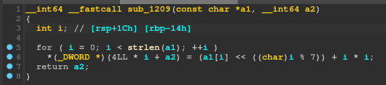
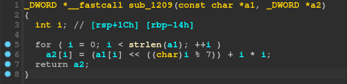
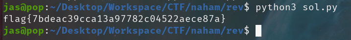

# Babyrev

## tl;dr 

Simple flag encryption

## Analysis

We get given a ELF binary called babyrev. As always, we first try to run it and see the initial behavior:



Seems like it asks for a username and password. Let's not waste time guessing and jump straight into static analysis with IDA. 

## Reversing the User Name

We load the binary in IDA and take a look at the main function:



We can instantly spot the first check here:

```c
if (strcmp(s1, "bossbaby"))
{
    printf("%s? I don't know you... stranger danger...", s1);
    exit(0);
}
puts("You're almost there!");
```

Since ```s1``` is read as the username, we can understand that the program requires the username to be ```bossbaby```, or else it will fail and exit. 

However, it doesn't end there. The program will then do another check with the following function:

```c
if ( (unsigned int)sub_12AD(v5) == 38 )
    printf("You're boss baby!");
```

So we would like that function to return 38? in order to win. Let's take a look at the function itself:

## Reversing the Password



Remember that this function had ```v5``` as an argument in main, which was the password that was scanned here:

```c
printf("Please enter your password: ");
__isoc99_scanf("%s", v5);
```

That means that ```a1``` will be the password buffer inside the context of this function as it is it's only argument:

```c
__int64 __fastcall sub_12AD(char *a1)
```

Initially when solving this I ignored most of the stuff in this function as it seems to be pointless. For example, looking at:

```c
if ( (v2 & 0xFFF) != 0 )
    *(__int64 *)((char *)&v6[-1] + (v2 & 0xFFF)) = *(__int64 *)((char *)&v6[-1] + (v2 & 0xFFF));
```

This looks like a useless bit of code, so naturally I will ignore this and come back later only if I am stuck. The actually important part of this function is the following:

```c
  sub_1209(s, v6);
  for ( i = 0; ; ++i )
  {
    v4 = i;
    if ( v4 >= strlen(s) )
      break;
    if ( dword_4020[i] == *((_DWORD *)v11 + i) )
      ++v8;
  }
  return v8;
```

A bunch of stuff happens here. In detail:
- Function ```sub_1209``` is called with ```s``` and ```v6``` as arguments. If we look at the start of the current function, we can see that ```s = a1```, so ```s``` is our password input. So some kind of function is ran on our password, let's keep this in mind and check later.
- We iterate starting from 0 till ```strlen(s)```(or the length of our input password) and advance a variable called v8 if ```dword_4020[i] == *((DWORD *)v11 + i)```. However, what is ```dword_4020``` and ```v11```?
    - ```dword_4020``` is a global array of some weird bytes and we can see it by double clicking on it: 
    - ```v11``` is set above as ```v11 = v6```, but v6 is actually set in the ```sub_1209``` function that we haven't looked at yet

## Tip
When looking at something like ```*((_DWORD *)v11 + i)``` in IDA, this could be translated to ```v11[i]```, if and only if ```v11``` is a array of DWORDS.

This is as when you cast a pointer to a "pointer to some sized variable" in C, the compiler will assume any following offseting (for example, ptr + 0, ptr + 1, etc) as: ptr + offset * sizeof(element), where element is the size of the type we casted it as.

So if we cast v11 to a DWORD*, it basically means:
```*(v11 + i * sizeof(DWORD))```

i = 0: *(v11 + 0) = v11[0]\
i = 1: *(v11 + 4) = v11[1]\
i = 2: *(v11 + 8) = v11[2]\
...

IDA doesn't actually know what the array is made for, and thus will most of the times produce these weird casts. If you are sure that this is a DWORD array, you can select the variable and hit ```Y```, which will bring up the change type window. You can then change the type to what you think it is:



Which will then make it look a lot more normal:



## Reversing the Password

Continuing where we left off, it is now pretty clear that each byte of the global ```dword_4020``` array is compared to each byte of the ```v11``` array. Let's look at the ```sub_1209``` function:



Hmmm, ```*(_DWORD *)(4LL * i + a2)``` doesn't seem right, let's use our new ✨reconstructing✨ skills we learnt above to turn this into a ```DWORD``` array:



Ah, much better. Each number of the a2 array is set to the corresponding number of the a1 array, ```shifted left``` by ```i % 7``` and then has ``` i * i ``` added to it. However, recall that ```a1``` is indeed our input password. Thus, what actually happens here, is each byte of our input password is manipulated with that formula, then put into the ```a2``` array, which is then compared with the global byte array.

So, if we want our password to be equal to the byte array after this formula is ran on it, we can just do the reverse, and run the reversed formula on the global byte array instead. Let's do that in python:

```py
bytes = [0x66, 0x0D9, 0x188, 0x341, 0x7C0, 0x6F9, 0x18A4, 0x95, 0x10A, 0x1D5, 0x37C, 0x3A9, 0x7B0, 0x1969, 0x127, 0x1A3, 0x1C4, 0x2B9, 0x754, 0x889, 0x0F50, 0x1F0, 0x254, 0x2D9, 0x558, 0x571, 0x924, 0x1019, 0x342, 0x3AD, 0x508, 0x6E9, 0x0A30, 0x10E1, 0x1284, 0x500, 0x5D2, 0x74D]

flag = ''
for i in range(len(bytes)):
    x = (bytes[i] - i * i) >> (i % 7)
    flag += chr(x)
    
print(flag)
```

I extracted all the bytes from the global array, then for each one of them, I apply the reversed formula:
- Subtract ```i * i``` as it's the last that's added in the normal formula
- Shift right instead of left, to bring to original position

And... voila!

